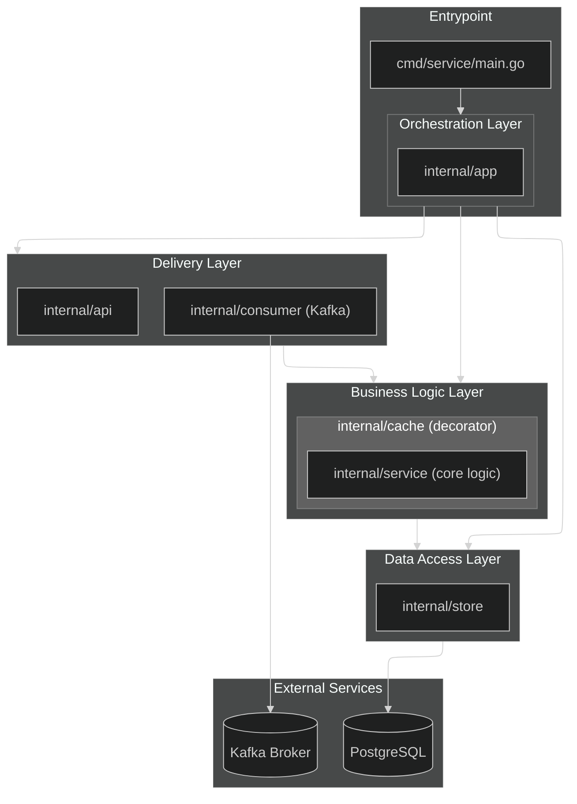

[Русский README](README.ru.md)

# L0 Task Project

This project is a Go-based application designed for handling orders, featuring a producer, a consumer, an API service, and a PostgreSQL database. It includes an LRU cache for efficient data retrieval and Prometheus/Grafana for monitoring.

## More specific details on design choices:
- [Database Schema](docs/database.md)
- [Consumer Descision Tree](docs/consumer.md)
- [Cache Implementation](docs/cache.md)
- [JSON Validation](docs/validation.md)
- [A bit about errors, metrcis and db health checks](docs/misc.md)

## Table of Contents

This project is a Go-based application designed for handling orders, featuring a producer, a consumer, an API service, and a PostgreSQL database. It includes an LRU cache for efficient data retrieval and Prometheus/Grafana for monitoring.

## Table of Contents

- [L0 Task Project](#l0-task-project)
  - [More specific details on design choices:](#more-specific-details-on-design-choices)
  - [Features](#features)
  - [Project Structure](#project-structure)
  - [Project Architecture Outline](#project-architecture-outline)
  - [Technologies Used](#technologies-used)
  - [Configuration and Environment](#configuration-and-environment)
    - [Environment Variables (`.env` and `docker-compose.yml`)](#environment-variables-env-and-docker-composeyml)
    - [Configuration File (`config.yaml` and `internal/config/config.go`)](#configuration-file-configyaml-and-internalconfigconfiggo)
    - [Secrets Management](#secrets-management)
    - [Ports](#ports)
    - [Kafka Topics](#kafka-topics)
  - [Usage / Running the Project](#usage--running-the-project)
    - [Starting Services with Docker Compose](#starting-services-with-docker-compose)
    - [Order Generation Script (`gen_orders.py`)](#order-generation-script-gen_orderspy)
    - [Producer Service (`cmd/producer/main.go`)](#producer-service-cmdproducermaingo)
    - [Makefile Targets](#makefile-targets)
  - [Database / Schema](#database--schema)
    - [Table Relations](#table-relations)
    - [Indexes](#indexes)
    - [Migration Instructions](#migration-instructions)
  - [Metrics / Monitoring / Observability](#metrics--monitoring--observability)
    - [Metrics](#metrics)
    - [Monitoring with Prometheus and Grafana](#monitoring-with-prometheus-and-grafana)
  - [API Endpoints](#api-endpoints)
  - [Graceful Shutdown](#graceful-shutdown)

## More specific details on design choices:
- [Database Schema](docs/database.md)
- [Consumer Descision Tree](docs/consumer.md)
- [Cache Implementation](docs/cache.md)
- [JSON Validation](docs/validation.md)
- [A bit about errors, metrcis and db health checks](docs/misc.md)

## Features

*   **Order Generation:** A producer service to generate and publish order data
*   **Order Consumption:** A consumer service to process order data concurrently
*   **API Service:** A web API to interact with the service's data
*   **PostgreSQL Database:** Persistent storage for order information
*   **LRU Cache:** In-memory caching for frequently accessed orders
*   **Monitoring:** Integration with Prometheus and Grafana for metrics and dashboards

## Project Structure

```
.env.example        # an example of .env, used by the docker compose
.gitignore          
config.yaml.example # an example of app (consumer-service) config
docker-compose.yml  
Dockerfile          # Dockerfile to build app and producer containers
gen_orders.py       # A Python script used to generate JSON payloads
locustfile.py       # A Python script used to make a simple load test
go.mod              
go.sum
Makefile            # Commands to speed up builds and teardowns
cmd/
├── producer/       # Order producer service
└── service/        # Consumer service
configs/
├── grafana/        # Grafana dashboards and datasources
└── prometheus/     # Prometheus configuration
internal/
├── api/            # API handlers, middleware, and UI templates
├── app/            # Main application logic orchestrator
├── config/         # Configuration loading
├── consumer/       # Order consumer logic
├── domain/         # Core domain models
├── pkg/            # Reusable packages (health, logger, metrics, sizeof)
├── service/        # Business logic layer and LRU cache implementation as its wrapper
└── store/          # Database interaction (with PostgreSQL)
sql/
├── 001_initial_schema.sql                          # Main schema
└── 002_add_timestamps_and_latest_orders_query.sql  # Add timestamps used by cache
```

## Project Architecture Outline
Below is the overall high-level project architecture outline. Note that it does not represent all the relations (e.g. some of the arrows should be two-sided, but are left as is to leave out the unnecessary clutter). Also common dependencies of the `internal/pkg` are left out (they are used by almost every other package, hence, the `pkg` name).


## Technologies Used

*   Go
*   PostgreSQL
*   Kafka 
*   Docker
*   Docker Compose
*   Prometheus
*   Grafana
*   HTML/CSS/JavaScript (UI)

## Configuration and Environment

The application's configuration is managed through a combination of `config.yaml` (based on `config.yaml.example`) and environment variables, primarily defined in `.env` (based on `.env.example`). Secrets, such as database passwords, are handled via environment variables.

### Environment Variables (`.env` and `docker-compose.yml`)

The `.env` file is used by `docker-compose.yml` to set up various services. Key environment variables include:

*   **PostgreSQL:**
    *   `POSTGRES_USER`: Database username (default: `postgres`)
    *   `POSTGRES_PASSWORD`: Database password (default: `password`)
    *   `POSTGRES_DB`: Database name (default: `orders_db`)
    *   `POSTGRES_PORT`: PostgreSQL port (default: `5433` for host, `5432` inside Docker)
    *   `POSTGRES_HOST`: PostgreSQL host (default: `localhost` for host, `postgres` inside Docker)

*   **Application (HTTP Server):**
    *   `HTTP_SERVER_PORT`: Port for the HTTP API service (default: `8080`)

*   **Kafka:**
    *   `KAFKA_BOOTSTRAP_SERVERS`: Kafka broker addresses (default: `localhost:9092` for host, `broker:29092` inside Docker)
    *   `KAFKA_CONSUMER_GROUP_ID`: Consumer group ID for the Kafka consumer (default: `orders-consumer`)
    *   `CONSUMER_TOPIC`: Kafka topic for the consumer (default: `orders`)
    *   `KAFKA_TOPIC`: Kafka topic for the producer (default: `orders`, used by `cmd/producer/main.go`)
    *   `KAFKA_BROKERS`: Kafka broker addresses for the producer (default: `localhost:9092`, used by `cmd/producer/main.go`)
    *   `KAFKA_CLIENT_ID`: Kafka client ID (default: `orders-producer`, can be overridden by `KAFKA_CLIENT_ID` env var).

*   **Zookeeper (Docker Compose):**
    *   `ZOOKEEPER_CLIENT_PORT`: Zookeeper client port (default: `2181`)
    *   `ZOOKEEPER_TICK_TIME`: Zookeeper tick time (default: `2000`)

*   **Kafka Broker (Docker Compose):**
    *   `KAFKA_BROKER_ID`: Kafka broker ID (default: `1`)
    *   `KAFKA_ZOOKEEPER_CONNECT`: Zookeeper connection string for Kafka (default: `zookeeper:2181`)
    *   `KAFKA_LISTENER_SECURITY_PROTOCOL_MAP`: Kafka listener security protocol map
    *   `KAFKA_ADVERTISED_LISTENERS`: Kafka advertised listeners
    *   `KAFKA_OFFSETS_TOPIC_REPLICATION_FACTOR`: Kafka offsets topic replication factor
    *   `KAFKA_TRANSACTION_STATE_LOG_MIN_ISR`: Kafka transaction state log min ISR
    *   `KAFKA_TRANSACTION_STATE_LOG_REPLICATION_FACTOR`: Kafka transaction state log replication factor

*   **Monitoring:**
    *   `PROMETHEUS_PORT`: Prometheus UI port (default: `9090`)
    *   `GRAFANA_PORT`: Grafana UI port (default: `3000`)

### Configuration File (`config.yaml` and `internal/config/config.go`)

The `config.yaml` file (copied from `config.yaml.example`) provides detailed configuration for the consumer service. These settings can be overridden by environment variables. The `internal/config/config.go` package handles loading these configurations, prioritizing environment variables over the `config.yaml` file, and providing sensible defaults.

Key sections in `config.yaml` include:

*   `http_server`: HTTP server settings (port, timeouts).
*   `database`: PostgreSQL connection details (host, port, user, password, dbname, SSL mode, connection pool settings).
*   `kafka`: Kafka consumer settings (bootstrap servers, consumer group ID, auto offset reset, enable auto commit, isolation level, poll interval, fetch sizes, session timeout, heartbeat interval).
*   `health`: Health check intervals and timeouts for the database.
*   `consumer`: Consumer worker count, job buffer size, retry settings.
*   `cache`: LRU cache capacity settings.

### Secrets Management

They are handled via environment variables, which are then picked up by `docker-compose.yml` and the application. Do not use such ways in the real production enviroments, please.

### Ports

The following ports are exposed by the services:

*   **HTTP Server:** `8080` (configurable via `HTTP_SERVER_PORT`)
*   **PostgreSQL:** `5432` (mapped from `POSTGRES_PORT` in `.env`, default `5433` on host)
*   **Kafka Broker:** `9092` (mapped from `KAFKA_PORT` in `.env`)
*   **Zookeeper:** `2181` (configurable via `ZOOKEEPER_CLIENT_PORT`)
*   **Prometheus:** `9090` (configurable via `PROMETHEUS_PORT`)
*   **Grafana:** `3000` (configurable via `GRAFANA_PORT`)

### Kafka Topics

The primary Kafka topic used for order processing is `orders`.

*   **Producer:** Publishes messages to the `orders` topic (configurable via `KAFKA_TOPIC` environment variable or `--topic` flag in `cmd/producer/main.go`).
*   **Consumer:** Subscribes to the `orders` topic (configurable via `CONSUMER_TOPIC` environment variable or `kafka.topic` in `config.yaml`).


## Usage / Running the Project

This section details how to run the project, including Docker Compose commands, CLI flags for the producer and order generation script, and useful `Makefile` targets.

### Starting Services with Docker Compose

To build and run all services (PostgreSQL, Kafka, Zookeeper, Producer, Consumer, Prometheus, Grafana):

```bash
docker compose up --build
```

Alternatively, you can use the `Makefile` target which also generates mock data and runs database migrations:

```bash
make run-all
```

This command performs the following steps:
1.  `gen`: Generates `mock.json` with 3600 orders (10% invalid) using `gen_orders.py`.
2.  `up-kafka`: starts Zookeeper and Kafka broker.
3.  `up-psql`: starts PostgreSQL.
4.  `migrate`: runs database migrations using Goose (requires Goose to be installed locally).
5.  `up-prod`: starts the Kafka producer service.
6.  `up-app`: starts the main consumer API service.
7.  `up-metric`: starts Prometheus and Grafana.

### Order Generation Script (`gen_orders.py`)

The `gen_orders.py` script generates mock JSON order data.

Usage:
```bash
python3 gen_orders.py [flags]
```

Flags:
*   `-n, --num-orders <int>`: Number of orders to generate (default: `100`).
*   `--min-items <int>`: Minimum number of items per order (default: `1`).
*   `--max-items <int>`: Maximum number of items per order (default: `5`).
*   `--invalid-rate <float>`: Fraction of orders to make invalid (0.0-1.0, default: `0.0`).
*   `-o, --output <filename>`: Output file name (default: `mock.json`).

Example (generates 3600 orders, 10% invalid, to `mock.json`):
```bash
python3 gen_orders.py -n 3600 --invalid-rate 0.1 -o mock.json
```

### Producer Service (`cmd/producer/main.go`)

The producer service sends order messages to Kafka. When run via Docker Compose, its command is specified in `docker-compose.yml`. You can also run it locally after building.

CLI Flags (used when running `bin/producer` directly or configured in `docker-compose.yml`):
*   `-file <path>`: Path to the JSON file with order data (default: `mock.json`).
*   `-rps <int>`: Requests per second (rate of sending messages, default: `1`).
*   `-invalid-json <int>`: Number of syntactically incorrect JSON messages to send (default: `0`).
*   `-gibberish <int>`: Number of non-JSON, rubbish messages to send (default: `0`).
*   `-topic <string>`: Kafka topic to produce to (default: `orders`, can be overridden by `KAFKA_TOPIC` env var).
*   `-brokers <string>`: Kafka bootstrap servers (default: `localhost:9092`, can be overridden by `KAFKA_BROKERS` env var).
*   `-client-id <string>`: Kafka client ID (default: `orders-producer`, can be overridden by `KAFKA_CLIENT_ID` env var).

### Makefile Targets

The `Makefile` provides convenient commands for common tasks:

*   `gen`: Generates mock JSON order data using `gen_orders.py`.
*   `up-kafka`: Starts Zookeeper and Kafka broker containers.
*   `up-psql`: Starts PostgreSQL container.
*   `up-prod`: Starts the producer service container.
*   `up-app`: Starts the main consumer API service container.
*   `up-metric`: Starts Prometheus and Grafana containers.
*   `migrate`: Runs database migrations using Goose.
*   `run-all`: Executes `gen`, `up-kafka`, `up-psql`, `migrate`, `up-prod`, `up-app`, `up-metric` in sequence.
*   `clean`: Prompts to delete `bin/`, `mock.json`, and all Docker containers/volumes.
*   `loc-build`: Builds local executable binaries for `service` and `producer` into the `bin/` directory.
*   `loc-runs`: Runs the `service` executable locally (foreground).
*   `loc-runp`: Runs the `producer` executable locally (background, with default flags).
*   `test`: Runs all Go tests with no cache.


## Database / Schema

The project uses a PostgreSQL database to store order information. The schema is defined across several tables with specific relationships.

The DB schema is as follows:


### Table Relations

*   **`orders`** is the central table.
*   **`deliveries`** and **`payments`** have a one-to-one relationship with `orders`, meaning each order has exactly one delivery record and one payment record. Their primary keys are also foreign keys referencing `orders.id`.
*   **`items`** has a one-to-many relationship with `orders`, meaning each order can have multiple items. `items.order_id` is a foreign key referencing `orders.id`.

### Indexes

*   `idx_items_order_id` on `items(order_id)` for fast lookups of items by order.
*   `idx_orders_order_uid` (UNIQUE) on `orders(order_uid)` for efficient and unique order UID lookups.

### Migration Instructions

Database migrations are managed using [Goose](https://github.com/pressly/goose). The migration files are located in the `sql/` directory.

To run migrations, ensure Goose is installed and configured. The `Makefile` provides a convenient target:

```bash
make migrate
```

This command connects to the PostgreSQL database using environment variables (e.g., `POSTGRES_USER`, `POSTGRES_PASSWORD`, `POSTGRES_HOST`, `POSTGRES_PORT`, `POSTGRES_DB`) and applies any pending migrations defined in `sql/`.

## Metrics / Monitoring / Observability

The project is set up with Prometheus for metrics collection and Grafana for visualization, along with structured logging using Zap.

### Metrics

Key metrics are exposed by the application via the `/metrics` endpoint (scraped by Prometheus) and defined in `internal/pkg/metrics/metrics.go`. These include:

*   **HTTP Request Metrics:**
    *   `http_total_requests`: Total count of HTTP requests, labeled by method, path, and response code.
    *   `http_request_duration`: Histogram of HTTP request durations, labeled by method and path.
*   **Consumer Metrics:**
    *   `consumer_processed_total`: Total number of processed messages by the Kafka consumer, labeled by status (i.e., `valid`, `invalid`, `error`).
*   **Cache Metrics:**
    *   `cache_hits_total`: Total number of cache hits.
    *   `cache_misses_total`: Total number of cache misses.
    *   `cache_response_time`: Histogram of cache response durations, labeled by operation (e.g., `get_order`, `insert_order`).
*   **Database Metrics:**
    *   `db_response_time`: Histogram of database response durations, labeled by operation.
    *   `db_up`: Gauge indicating database reachability (1 for up, 0 for down, displayed as either 'OK' or 'FAIL').
    *   `db_transient_err_total`: Total number of recoverable database errors ('hiccups').

### Monitoring with Prometheus and Grafana

Prometheus and Grafana are deployed via `docker-compose.yml` for comprehensive monitoring.

*   **Prometheus:**
    *   Configured to scrape metrics from the `app` service (the main consumer API) at `http://app:8080/metrics` as defined in `configs/prometheus/prometheus.yml`.
    *   Accessible on the host via port `9090` (configurable via `PROMETHEUS_PORT` in `.env`).

*   **Grafana:**
    *   Pre-provisioned with a dashboard (`configs/grafana/provisioning/dashboards/dashboard.json`) that visualizes the application's key metrics.
    *   Uses a Prometheus data source configured in `configs/grafana/provisioning/datasources/datasource.yml`.
    *   Accessible on the host via port `3000` (configurable via `GRAFANA_PORT` in `.env`).

To access the dashboards, navigate to `http://localhost:3000` (or your configured Grafana port) in your browser after running `docker compose up` or `make run-all`.

### Logging

The application uses [Zap](https://pkg.go.dev/go.uber.org/zap) for structured logging. The logging setup is defined in `internal/pkg/logger/`.

*   **`logger.go`**: Defines a common `Logger` interface.
*   **`zap_dev.go`**: Provides a `NewDevelopmentLogger` for development-friendly output.
*   **`zap_sugar.go`**: Provides a `NewSugarLogger` for a more production-ready, sugared logger.

Logs are output to standard output (stdout) and can be viewed using `docker compose logs <service_name>` (e.g., `docker compose logs app`).

## API Endpoints

The API service typically runs on port `8080` (configurable via `.env` if running via a container or through regular enviroment variables).

*   `GET /`: Home page (UI).
*   `GET /order/{order_uid}`: Retrieve order details by UID.
*   `GET /metrics`: Endpoint scraped by prometheus


## Graceful Shutdown

The service is designed to shut down gracefully to prevent data loss and ensure clean resource management. If it receives a `SIGINT` or a `SIGTERM` signal it does the next things:

1.  **Shutdown Initiated:** Upon receiving a signal, the application begins the shutdown process.
2.  **Consumer Stop:** The Kafka consumer is signaled to stop polling for new messages and finish processing any in-flight messages.
3.  **HTTP Server Shutdown:** The HTTP server stops accepting new connections and waits for existing requests to complete, up to a configured timeout (`shutdown_timeout` in `config.yaml`).
4.  **Resource Cleanup:** Finally, resources like the database connection pool are closed.

This ensures that the application shuts down cleanly, without interrupting ongoing work or leaving connections open.
