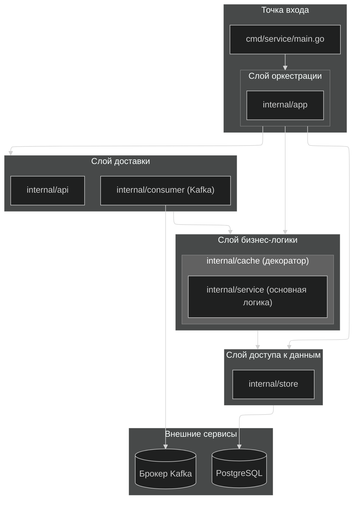
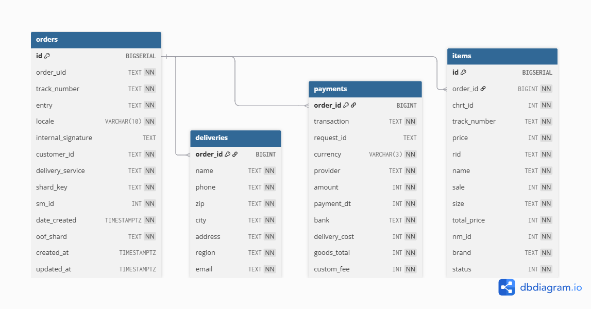

[English README](README.md)

# Проект к заданию L0

Этот проект представляет собой сервис на Go, предназначенный для обработки заказов, и включает в себя producer (далее продюсер), consumer (далее потребитель), API-сервис и базу данных PostgreSQL. Также сервис использует LRU-кэш для эффективного извлечения данных и Prometheus/Grafana для мониторинга.

## Более подробная информация о проектных решениях:
- [Схема базы данных](docs/ru/database.ru.md)
- [Принцип работы потребителя](docs/ru/consumer.ru.md)
- [Реализация кэша](docs/ru/cache.ru.md)
- [Валидация JSON](docs/ru/validation.ru.md)
- [Немного об ошибках, метриках и проверках состояния БД](docs/ru/misc.ru.md)

## Содержание

- [Проект-задание L0](#проект-задание-l0)
  - [Более подробная информация о проектных решениях:](#более-подробная-информация-о-проектных-решениях)
  - [Возможности](#возможности)
  - [Структура проекта](#структура-проекта)
  - [Схема архитектуры проекта](#схема-архитектуры-проекта)
  - [Используемые технологии](#используемые-технологии)
  - [Конфигурация и окружение](#конфигурация-и-окружение)
    - [Переменные окружения (`.env` и `docker-compose.yml`)](#переменные-окружения-env-и-docker-composeyml)
    - [Файл конфигурации (`config.yaml` и `internal/config/config.go`)](#файл-конфигурации-configyaml-и-internalconfigconfiggo)
    - [Управление секретами](#управление-секретами)
    - [Порты](#порты)
    - [Топики Kafka](#топики-kafka)
  - [Использование / Запуск проекта](#использование--запуск-проекта)
    - [Запуск сервисов с помощью Docker Compose](#запуск-сервисов-с-помощью-docker-compose)
    - [Скрипт генерации заказов (`gen_orders.py`)](#скрипт-генерации-заказов-gen_orderspy)
    - [Сервис-продюсер (`cmd/producer/main.go`)](#сервис-продюсер-cmdproducermaingo)
    - [Команды Makefile](#команды-makefile)
  - [База данных / Схема](#база-данных--схема)
    - [Отношения между таблицами](#отношения-между-таблицами)
    - [Индексы](#индексы)
    - [Инструкции по миграции](#инструкции-по-миграции)
  - [Метрики / Мониторинг / Наблюдаемость](#метрики--мониторинг--наблюдаемость)
    - [Метрики](#метрики)
    - [Мониторинг с помощью Prometheus и Grafana](#мониторинг-с-помощью-prometheus-и-grafana)
  - [API Endpoints](#api-endpoints)
  - [Корректное завершение работы](#корректное-завершение-работы)


## Возможности

*   **Генерация заказов:** сервис-продюсер для отправки заказов в очередь (в Kafka)
*   **Обработка заказов:** сервис-потребитель для конкурентной обработки данных о заказах
*   **API-сервис:** API для взаимодействия с сервисом-потребителем
*   **База данных PostgreSQL:** хранилище информации о заказах
*   **LRU-кэш:** кэширование ифнормации о заказах для снижения нагрузки на БД
*   **Мониторинг:** интеграция с Prometheus и Grafana для сбора метрик и визуализации
*   **Очередь DLQ (Dead-Letter Queue):** Перенаправляет невалидные или необрабатываемые сообщения для последующего анализа.

## Структура проекта

```bash
.env.example        # пример .env файла, используемого Docker Compose
.gitignore          
config.yaml.example # пример конфигурационного файла приложения (consumer-service)
docker-compose.yml  
Dockerfile          # Dockerfile для сборки контейнеров приложения и продюсера
gen_orders.py       # Python-скрипт для генерации JSON-данных
locustfile.py       # Python-скрипт для простого нагрузочного тестирования
go.mod              
go.sum
Makefile            # Команды для ускорения сборки и развертывания
cmd/
├── producer/       # Скрипт-продюсер заказов
└── service/        # Сервис-консюмер
configs/
├── grafana/        # Дашборды и источники данных Grafana
└── prometheus/     # Конфигурация Prometheus
internal/
├── api/            # Обработчики API, middleware и шаблоны UI
├── app/            # Основной оркестратор логики приложения
├── config/         # Загрузка конфигурации
├── consumer/       # Логика потребителя заказов
├── domain/         # Основные доменные модели
├── pkg/            # Переиспользуемые пакеты (health, logger, metrics, sizeof)
├── service/        # Слой бизнес-логики и реализация LRU-кэша как его обертки
└── store/          # Взаимодействие с базой данных (PostgreSQL)
sql/
├── 001_initial_schema.sql                          # Основная схема БД
└── 002_add_timestamps_and_latest_orders_query.sql  # Добавление временных меток, используемых кэшем
```

## Схема архитектуры проекта
Ниже представлена общая высокоуровневая схема архитектуры проекта. Обратите внимание, что она не отражает всех связей (например, некоторые стрелки должны быть двусторонними, но оставлены так, чтобы избежать нагромождения). Также опущены общие зависимости (`internal/pkg`, они используются почти всеми остальными пакетами).


## Используемые технологии

*   Go
*   PostgreSQL
*   Kafka & Zookeeper (Confluent)
*   Docker & Docker Compose
*   Prometheus & Grafana
*   HTML & CSS & JavaScript (UI)

## Конфигурация и окружение

Конфигурация приложения управляется через комбинацию файла `config.yaml` (на основе `config.yaml.example`) и переменных окружения, в основном определенных в `.env` (на основе `.env.example`). Секреты, такие как пароли к базе данных, передаются через переменные окружения.

### Переменные окружения (про `.env` и `docker-compose.yml`)

Файл `.env` используется `docker-compose.yml` для настройки различных сервисов. Ключевые переменные окружения включают:

*   **PostgreSQL:**
    *   `POSTGRES_USER`: Имя пользователя базы данных (по умолчанию: `postgres`)
    *   `POSTGRES_PASSWORD`: Пароль пользователя базы данных (по умолчанию: `password`)
    *   `POSTGRES_DB`: Название базы данных (по умолчанию: `orders_db`)
    *   `POSTGRES_PORT`: Порт PostgreSQL (по умолчанию: `5433` для хоста, `5432` внутри Docker)
    *   `POSTGRES_HOST`: Хост PostgreSQL (по умолчанию: `localhost` для хоста, `postgres` внутри Docker)

*   **Приложение (HTTP-сервер):**
    *   `HTTP_SERVER_PORT`: Порт для API-сервиса (по умолчанию: `8080`)

*   **Kafka:**
    *   `KAFKA_BOOTSTRAP_SERVERS`: Адреса брокеров Kafka (по умолчанию: `localhost:9092` для хоста, `broker:29092` внутри Docker)
    *   `KAFKA_CONSUMER_GROUP_ID`: ID группы потребителей Kafka (по умолчанию: `orders-consumer`)
    *   `CONSUMER_TOPIC`: Топик Kafka для потребителя (по умолчанию: `orders`)
    *   `KAFKA_TOPIC`: Топик Kafka для продюсера (по умолчанию: `orders`, используется `cmd/producer/main.go`)
    *   `KAFKA_BROKERS`: Адреса брокеров Kafka для продюсера (по умолчанию: `localhost:9092`, используется `cmd/producer/main.go`)
    *   `KAFKA_CLIENT_ID`: ID клиента Kafka (по умолчанию: `orders-producer`, может быть переопределен переменной окружения `KAFKA_CLIENT_ID`).

*   **Zookeeper (Docker Compose):**
    *   `ZOOKEEPER_CLIENT_PORT`: Клиентский порт Zookeeper (по умолчанию: `2181`)
    *   `ZOOKEEPER_TICK_TIME`: Время такта Zookeeper (по умолчанию: `2000`)

*   **Брокер Kafka (Docker Compose):**
    *   `KAFKA_BROKER_ID`: ID брокера Kafka (по умолчанию: `1`)
    *   `KAFKA_ZOOKEEPER_CONNECT`: Строка подключения к Zookeeper для Kafka (по умолчанию: `zookeeper:2181`)
    *   `KAFKA_LISTENER_SECURITY_PROTOCOL_MAP`: Карта протоколов безопасности слушателей Kafka
    *   `KAFKA_ADVERTISED_LISTENERS`: Рекламируемые слушатели Kafka
    *   `KAFKA_OFFSETS_TOPIC_REPLICATION_FACTOR`: Фактор репликации топика смещений Kafka
    *   `KAFKA_TRANSACTION_STATE_LOG_MIN_ISR`: Минимальное количество синхронизированных реплик для лога состояния транзакций Kafka
    *   `KAFKA_TRANSACTION_STATE_LOG_REPLICATION_FACTOR`: Фактор репликации для лога состояния транзакций Kafka

*   **Мониторинг:**
    *   `PROMETHEUS_PORT`: Порт UI Prometheus (по умолчанию: `9090`)
    *   `GRAFANA_PORT`: Порт UI Grafana (по умолчанию: `3000`)

### Файл конфигурации (про `config.yaml` и `internal/config/config.go`)

Файл `config.yaml` (скопированный из `config.yaml.example`) предоставляет детальную конфигурацию для сервиса-потребителя. Эти настройки могут быть переопределены переменными окружения. Пакет `internal/config/` отвечает за загрузку этих конфигураций, отдавая приоритет переменным окружения перед файлом `config.yaml` и предоставляя разумные значения по умолчанию (они доступны в примере конфиг-файла).

Ключевые разделы в `config.yaml`:

*   `http_server`: настройки HTTP-сервера (порт, таймауты).
*   `database`: детали подключения к PostgreSQL (DSN - хост, порт, пользователь, пароль, имя БД, режим SSL, а также настройки пула соединений).
*   `kafka`: настройки потребителя Kafka (bootstrap servers, ID группы потребителей, auto offset reset, enable auto commit, isolation level, интервал опроса, размеры выборки, таймаут сессии, харт-бит интервал).
*   `health`: интервалы и таймауты проверки состояния базы данных.
*   `consumer`: количество воркеров-потребителя, размер буфера задач, настройки повторных попыток.
*   `cache`: настройки емкости LRU-кэша, максимальный размер отдельной записи

### Управление секретами

Секреты передаются через переменные окружения, которые затем используются `docker-compose.yml` и приложением

### Порты

Следующие порты используются сервисами (по умолчанию):

*   **HTTP-сервер:** `8080` (`HTTP_SERVER_PORT`)
*   **PostgreSQL:** `5432` (`POSTGRES_PORT` из `.env`, по умолчанию `5433` на хосте)
*   **Брокер Kafka:** `9092` (`KAFKA_PORT` из `.env`)
*   **Zookeeper:** `2181` (`ZOOKEEPER_CLIENT_PORT`)
*   **Prometheus:** `9090` (`PROMETHEUS_PORT`)
*   **Grafana:** `3000` (`GRAFANA_PORT`)

### Топики Kafka

Основной топик Kafka, используемый для обработки заказов, — `orders`.

*   **Продюсер:** Публикует сообщения в топик `orders` (настраивается через переменную окружения `KAFKA_TOPIC` или флаг `--topic` в `cmd/producer/main.go`).
*   **Потребитель:** Подписывается на топик `orders` (настраивается через переменную окружения `CONSUMER_TOPIC` или `kafka.topic` в `config.yaml`).
*   **DLQ":** Необрабатываемые сообщения отправляются в топик `orders-dlq` (настраивается через `consumer.dlq.topic` в `config.yaml`).


## Использование / Запуск проекта

В этом разделе подробно описывается, как запустить проект, включая команды Docker Compose, флаги CLI для продюсера и скрипта генерации заказов, а также полезные команды `Makefile`.

### Запуск сервисов с помощью Docker Compose

Чтобы собрать и запустить все сервисы (PostgreSQL, Kafka, Zookeeper, Producer, Consumer, Prometheus, Grafana):

```bash
docker compose up --build
```

В качестве альтернативы можно загрузить образы сревиса-продюсера и сервиса-потребится с DockerHub и использовать команду `Makefile`, которая также генерирует тестовые данные и выполняет миграции базы данных:

```bash
docker push goinginblind/l0-task-producer:latest
docker push goinginblind/l0-task-app:latest
make run-all
```

Эта команда выполняет следующие шаги:
1.  `gen`: Генерирует `mock.json` с 3600 заказами (10% из которых невалидны) с помощью `gen_orders.py`.
2.  `up-kafka`: запускает Zookeeper и брокер Kafka.
3.  `up-psql`: запускает PostgreSQL.
4.  `migrate`: выполняет миграции базы данных с помощью Goose (**требуется локальная установка Goose**).
5.  `up-prod`: запускает сервис-продюсер Kafka.
6.  `up-app`: запускает основной API-сервис потребителя.
7.  `up-metric`: запускает Prometheus и Grafana.

### Скрипт генерации заказов (`gen_orders.py`)

Скрипт `gen_orders.py` генерирует тестовые данные о заказах в формате JSON.

Использование:
```bash
python3 gen_orders.py [флаги]
```

Флаги:
*   `-n, --num-orders <int>`: количество генерируемых заказов (по умолчанию: `100`).
*   `--min-items <int>`: минимальное количество товаров в заказе (по умолчанию: `1`).
*   `--max-items <int>`: максимальное количество товаров в заказе (по умолчанию: `5`).
*   `--invalid-rate <float>`: доля невалидных заказов (0.0-1.0, по умолчанию: `0.0`).
*   `-o, --output <filename>`: имя выходного файла (по умолчанию: `mock.json`).

Пример (генерирует 3600 заказов, 10% невалидных, в файл `mock.json`):
```bash
python3 gen_orders.py -n 3600 --invalid-rate 0.1 -o mock.json
```

### Сервис-продюсер (`cmd/producer/main.go`)

Сервис-продюсер отправляет сообщения о заказах в Kafka. При запуске через Docker Compose его команда указывается в `docker-compose.yml`. Вы также можете запустить его локально после сборки.

Флаги CLI (используются при прямом запуске `bin/producer` или настраиваются в `docker-compose.yml`):
*   `-file <path>`: путь к JSON-файлу с данными о заказах (по умолчанию: `mock.json`).
*   `-rps <int>`: запросов в секунду (скорость отправки сообщений, по умолчанию: `1`).
*   `-invalid-json <int>`: количество синтаксически некорректных JSON-сообщений для отправки (по умолчанию: `0`).
*   `-gibberish <int>`: количество "мусорных" сообщений, не являющихся JSON (по умолчанию: `0`).
*   `-topic <string>`: топик Kafka для публикации (по умолчанию: `orders`, может быть переопределен переменной окружения `KAFKA_TOPIC`).
*   `-brokers <string>`: bootstrap servers Kafka (по умолчанию: `localhost:9092`, может быть переопределен переменной окружения `KAFKA_BROKERS`).
*   `-client-id <string>`: ID клиента Kafka (по умолчанию: `orders-producer`, может быть переопределен переменной окружения `KAFKA_CLIENT_ID`).

### Команды Makefile

`Makefile` предоставляет (потенциально) удобные команды для общих задач:

*   `gen`: генерирует тестовые JSON-данные с помощью `gen_orders.py`.
*   `up-kafka`: запускает контейнеры Zookeeper и брокера Kafka.
*   `up-psql`: запускает контейнер PostgreSQL.
*   `up-prod`: запускает контейнер сервиса-продюсера.
*   `up-app`: запускает контейнер основного API-сервиса потребителя.
*   `up-metric`: запускает контейнеры Prometheus и Grafana.
*   `migrate`: выполняет миграции базы данных с помощью Goose.
*   `clean`: запрашивает подтверждение на удаление `bin/`, `mock.json` и всех контейнеров/томов Docker (и, собственно, удаляет).
*   `loc-build`: собирает локальные исполняемые файлы для `service` и `producer` в `bin/`.
*   `loc-runs`: запускает исполняемый файл `service` локально (в foreground).
*   `loc-runp`: запускает исполняемый файл `producer` локально (в background, с флагами по умолчанию).
*   `test`: запускает все тесты без кэша.
*   `run-all`: последовательно выполняет `gen`, `up-kafka`, `up-psql`, `migrate`, `up-prod`, `up-app`, `up-metric`.


## База данных / Схема

Проект использует базу данных PostgreSQL для хранения информации о заказах. Схема определена в нескольких таблицах, подробнее также можно узнать в [этом файле](/docs/ru/database.ru.md)

Схема БД выглядит следующим образом:



### Отношения между таблицами

*   **`orders`** — центральная таблица.
*   **`deliveries`** и **`payments`** имеют отношение один-к-одному с `orders`, что означает, что у каждого заказа есть ровно одна запись о доставке и одна запись об оплате. Их первичные ключи также являются внешними ключами, ссылающимися на `orders.id`.
*   **`items`** имеет отношение один-ко-многим с `orders`, что означает, что у каждого заказа может быть несколько товаров. `items.order_id` является внешним ключом, ссылающимся на `orders.id`.

### Индексы

*   `idx_items_order_id` на `items(order_id)` для быстрого поиска товаров по заказу.
*   `idx_orders_order_uid` (UNIQUE) на `orders(order_uid)` для эффективного и уникального поиска по UID заказа.

### Инструкции по миграции

Миграции базы данных управляются с помощью [Goose](https://github.com/pressly/goose). Файлы миграций находятся в каталоге `sql/`.

Для запуска миграций убедитесь, что Goose установлен и настроен. `Makefile` предоставляет удобную команду:

```bash
make migrate
```

Эта команда подключается к базе данных PostgreSQL, используя переменные окружения (например, `POSTGRES_USER`, `POSTGRES_PASSWORD`, `POSTGRES_HOST`, `POSTGRES_PORT`, `POSTGRES_DB`), и применяет все ожидающие миграции, определенные в `sql/`.

## Метрики / Мониторинг / Наблюдаемость

Проект настроен с использованием Prometheus для сбора метрик и Grafana для их визуализации, а также структурированного логирования с помощью Zap.

### Метрики

Ключевые метрики предоставляются приложением через эндпоинт `/metrics` (собираются Prometheus) и определены в `internal/pkg/metrics/metrics.go`. К ним относятся:

*   **Метрики HTTP-запросов:**
    *   `http_total_requests`: общее количество HTTP-запросов с метками по методу, пути и коду ответа.
    *   `http_request_duration`: гистограмма длительности HTTP-запросов с метками по методу и пути.
*   **Метрики потребителя:**
    *   `consumer_processed_total`: общее количество обработанных сообщений потребителем Kafka с метками по статусу (т. е. `valid`, `invalid`, `error`).
*   **Метрики кэша:**
    *   `cache_hits_total`: общее количество попаданий в кэш.
    *   `cache_misses_total`: общее количество промахов кэша.
    *   `cache_response_time`: гистограмма времени ответа кэша с метками по операции (например, `get_order`, `insert_order`).
*   **Метрики базы данных:**
    *   `db_response_time`: гистограмма времени ответа базы данных с метками по операции (`get` или `insert`)
    *   `db_up`: бинарный показатель доступности базы данных (1 — доступна, 0 — недоступна, отображается как 'OK' или 'FAIL' соотв.)
    *   `db_transient_err_total`: Общее количество восстановимых ошибок БД (например потери соединения более определенного интервала времени).

### Мониторинг с помощью Prometheus и Grafana

Prometheus и Grafana развертываются через `docker-compose.yml` для комплексного мониторинга.

*   **Prometheus:**
    *   Настроен на сбор метрик с сервиса `app` (основной API потребителя) по адресу `http://app:8080/metrics`, как определено в `configs/prometheus/prometheus.yml`.
    *   Доступен на хосте через порт `9090` (настраивается через `PROMETHEUS_PORT` в `.env`).

*   **Grafana:**
    *   Предварительно настроен с дашбордом (`configs/grafana/provisioning/dashboards/dashboard.json`), который визуализирует ключевые метрики приложения.
    *   Использует источник данных Prometheus, настроенный в `configs/grafana/provisioning/datasources/datasource.yml`.
    *   Доступен на хосте через порт `3000` (настраивается через `GRAFANA_PORT` в `.env`).

Для доступа к дашбордам перейдите по адресу `http://localhost:3000` (или по вашему настроенному порту Grafana) в браузере после запуска `docker compose up` или `make run-all`. Аккаунт и пароль по умолчанию: `admin` в обоих полях. 

### Логирование

Приложение использует [Zap](https://pkg.go.dev/go.uber.org/zap) для структурированного логирования. Настройка логирования определена в `internal/pkg/logger/`

*   **`logger.go`**: определяет общий интерфейс `Logger`.
*   **`zap_dev.go`**: предоставляет `NewDevelopmentLogger` для удобного вывода в процессе разработки.
*   **`zap_sugar.go`**: предоставляет `NewSugarLogger` для более готового к продакшену логгера (в общем-то замена сахарного логгера на другой не должна составить труда, поскольку используется интерфейс)

Логи выводятся в стандартный вывод (stdout) и могут быть просмотрены с помощью `docker compose logs <имя_сервиса>` (например, `docker compose logs app`).

## API Endpoints

API-сервис обычно работает на порту `8080` (можно настроить через `.env` при запуске в контейнере или через обычные переменные окружения).

*   `GET /`: Домашняя страница (UI).
*   `GET /order/{order_uid}`: Получение информации о заказе по UID.
*   `GET /metrics`: Эндпоинт для сбора метрик Prometheus.


## Корректное завершение работы

Сервис спроектирован для корректного завершения работы, чтобы предотвратить потерю данных и обеспечить чистое управление ресурсами. При получении сигнала `SIGINT` или `SIGTERM` он выполняет следующие действия:

1.  **Инициация завершения:** при получении сигнала приложение начинает процесс завершения работы.
2.  **Остановка потребителя:** потребителю Kafka подается сигнал прекратить опрос новых сообщений и завершить обработку всех сообщений, находящихся "на лету".
3.  **Завершение работы HTTP-сервера:** HTTP-сервер перестает принимать новые соединения и ожидает завершения существующих запросов в течение настроенного таймаута (`shutdown_timeout` в `config.yaml`).
4.  **Освобождение ресурсов:** наконец, закрываются ресурсы, такие как пул соединений с базой данных.

Это гарантирует, что приложение завершает работу чисто, не прерывая текущие операции и не оставляя открытых соединений, корректно завершает все горутины.
