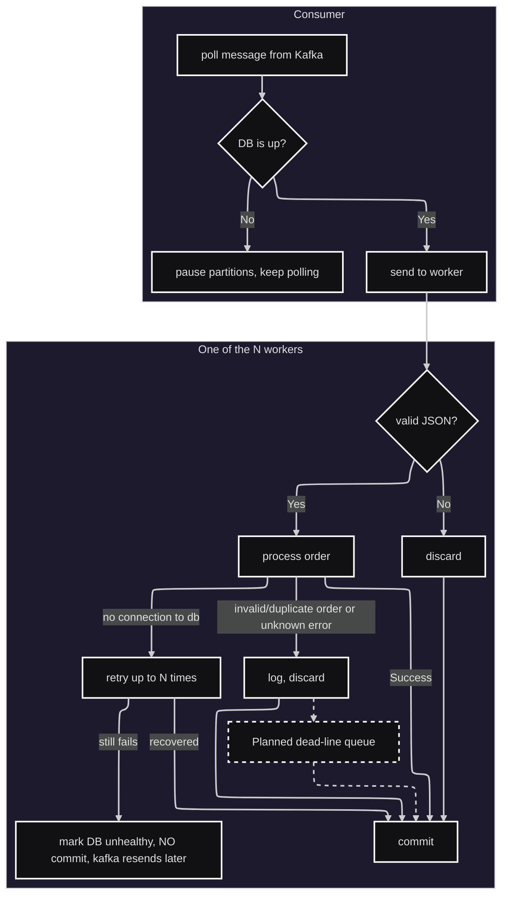

# What the cosumer does?

Notes:
1. **How many workers?**
The amount of workers is configurable via enviroment or `config.yaml`
2. **Why are invalids, duplicates and unknown errors discarded?**
These orders are logged by their order_uid, and I intended to send them to a dead-line queue, but had no time (as of now) to implement it.
3. **What exactly happens when the database is down?**
The worker first retries with exponential backoff (too, configurable) in case the connection was lost because of the transient errors (e.g. 1 ms hiccup), then if it fails too, the worker skips message without commits, marks db as unhealthy and the service's health checker kicks in. It pings the database once each N seconds waiting for it to be up.
4. **Why keep polling if the database connection is down?**
It keeps the heartbeat of the consumer up on the Kafka-side, so the consumer is not kicked out. If the database connection lost times out, then the whole program will gracefully exit.
5. **What happens if the DB is up again?**
The consumer proceeds as normally, it again
