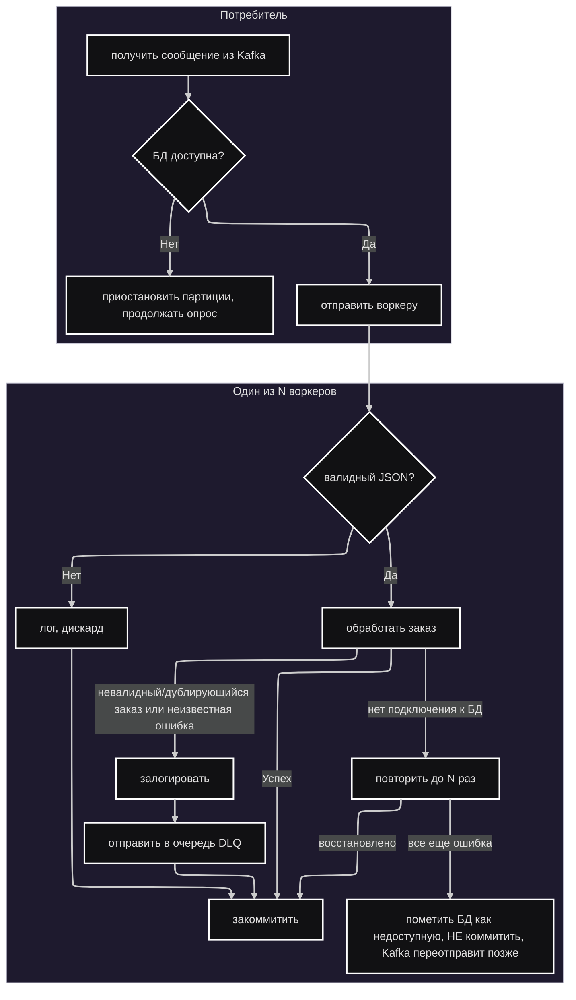

# Что делает потребитель?

Примечания:
1.  **Сколько воркеров?**
    Количество воркеров настраивается через переменные окружения или `config.yaml`, но поумолчанию их 4
2.  **Что происходит с невалидными заказами, дубликатами и заказами с неизвестными ошибками?**
    Эти заказы логируются по их `order_uid`, а затем отправляются в очередь "мертвых сообщений" (Dead-Letter Queue, DLQ) для последующей проверки и возможной повторной обработки. Топик DLQ по умолчанию — `orders-dlq`. Это предотвращает блокировку потребителя "ядовитыми" сообщениями, гарантируя при этом, что данные не будут потеряны.
3.  **Что именно происходит, когда база данных недоступна?**
    Сначала воркер пытается повторить операцию с экспоненциальной задержкой (также настраиваемой) на случай, если соединение было потеряно из-за временных ошибок (например, сбой на 1 мс). Если это тоже не удается, воркер пропускает сообщение без коммита, помечает БД как недоступную, и включается проверка состояния сервиса. Она пингует базу данных каждые N секунд, ожидая ее восстановления
4.  **Зачем продолжать опрос, если соединение с базой данных потеряно?**
    Это поддерживает heartbeat потребителя на стороне Kafka, чтобы его не отключили от группы
5.  **Что произойдет, если БД снова станет доступна?**
    Потребитель возобновит нормальную работу после того, как снова пропингует БД и получит от нее ответ.

### Другая документация:
* [Схема базы данных](database.ru.md)
* [Реализация кэша](cache.ru.md)
* [Валидация JSON](validation.ru.md)
* [Ошибки, метрики и проверки состояния БД](misc.ru.md)

### Вернуться к [Основному README](../../README.ru.md)
