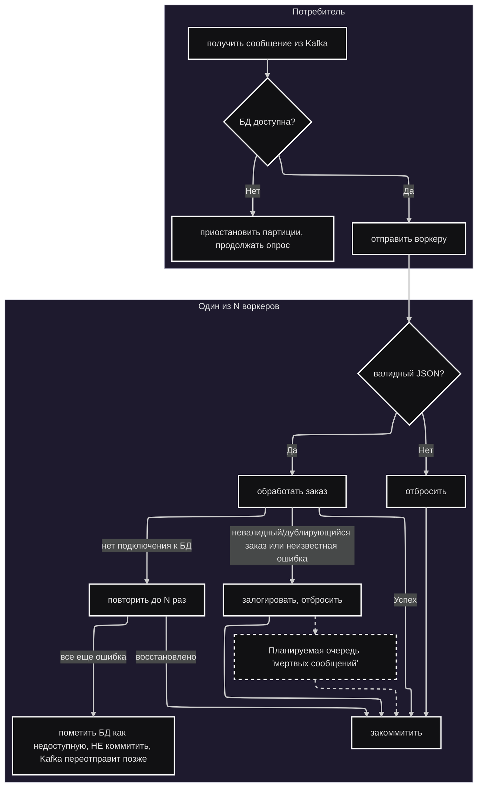

# Что делает потребитель?


Примечания:
1.  **Сколько воркеров?**
    Количество воркеров настраивается через переменные окружения или `config.yaml`, но поумолчанию их 4
2.  **Почему невалидные заказы, дубликаты и заказы с неизвестными ошибками отбрасываются?**
    Эти заказы логируются по их `order_uid`, и я намеревался отправлять их в очередь "мертвых сообщений" (dead-letter queue), но (на данный момент) не хватило времени на реализацию, в коде стоят только TODO-плейсхолдеры.
3.  **Что именно происходит, когда база данных недоступна?**
    Сначала воркер пытается повторить операцию с экспоненциальной задержкой (также настраиваемой) на случай, если соединение было потеряно из-за временных ошибок (например, сбой на 1 мс). Если это тоже не удается, воркер пропускает сообщение без коммита, помечает БД как недоступную, и включается проверка состояния сервиса. Она пингует базу данных каждые N секунд, ожидая ее восстановления
4.  **Зачем продолжать опрос, если соединение с базой данных потеряно?**
    Это поддерживает heartbeat потребителя на стороне Kafka, чтобы его не отключили от группы. Если все таймауты ()
5.  **Что произойдет, если БД снова станет доступна?**
    Потребитель возобновит нормальную работу после того, как снова пропингует БД и получит от нее ответ.

### Другая документация:
* [Схема базы данных](database.ru.md)
* [Реализация кэша](cache.ru.md)
* [Валидация JSON](validation.ru.md)
* [Ошибки, метрики и проверки состояния БД](misc.ru.md)

### Вернуться к [Основному README](../../README.ru.md)

config:
  layout: elk
  theme: redux-dark
---
flowchart TD
 subgraph Consumer["Потребитель"]
        B{"БД доступна?"}
        A["получить сообщение из Kafka"]
        C["приостановить партиции, продолжать опрос"]
        D["отправить воркеру"]
  end
 subgraph subGraph1["Один из N воркеров"]
        E{"валидный JSON?"}
        F["отбросить"]
        G["обработать заказ"]
        I["залогировать, отбросить"]
        Z["Планируемая очередь 'мертвых сообщений'"]
        H["закоммитить"]
        K["повторить до N раз"]
        M["пометить БД как недоступную, НЕ коммитить, Kafka переотправит позже"]
  end
    A --> B
    B -- Нет --> C
    B -- Да --> D
    D --> E
    E -- Нет --> F
    E -- Да --> G
    I --> Z & H
    Z --> H
    F --> H
    G -- невалидный/дублирующийся заказ или неизвестная ошибка --> I
    G -- Успех --> H
    G -- нет подключения к БД --> K
    K -- восстановлено --> H
    K -- все еще ошибка --> M
    style Z stroke-dasharray: 5 5
    linkStyle 6 stroke-dasharray: 5 5,fill:none
    linkStyle 8 stroke-dasharray: 5 5,fill:none

```
Примечания:
1.  **Сколько воркеров?**
    Количество воркеров настраивается через переменные окружения или `config.yaml`, но поумолчанию их 4
2.  **Почему невалидные заказы, дубликаты и заказы с неизвестными ошибками отбрасываются?**
    Эти заказы логируются по их `order_uid`, и я намеревался отправлять их в очередь "мертвых сообщений" (dead-letter queue), но (на данный момент) не хватило времени на реализацию, в коде стоят только TODO-плейсхолдеры.
3.  **Что именно происходит, когда база данных недоступна?**
    Сначала воркер пытается повторить операцию с экспоненциальной задержкой (также настраиваемой) на случай, если соединение было потеряно из-за временных ошибок (например, сбой на 1 мс). Если это тоже не удается, воркер пропускает сообщение без коммита, помечает БД как недоступную, и включается проверка состояния сервиса. Она пингует базу данных каждые N секунд, ожидая ее восстановления
4.  **Зачем продолжать опрос, если соединение с базой данных потеряно?**
    Это поддерживает heartbeat потребителя на стороне Kafka, чтобы его не отключили от группы. Если все таймауты ()
5.  **Что произойдет, если БД снова станет доступна?**
    Потребитель возобновит нормальную работу после того, как снова пропингует БД и получит от нее ответ.
