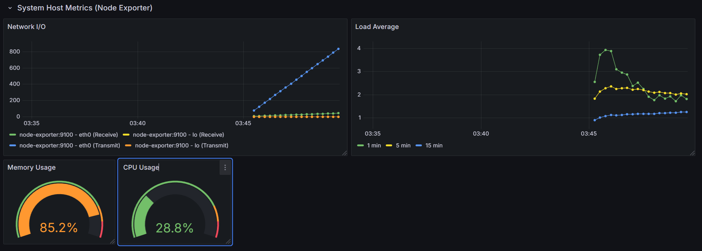
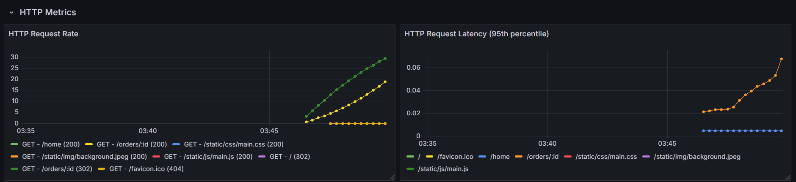
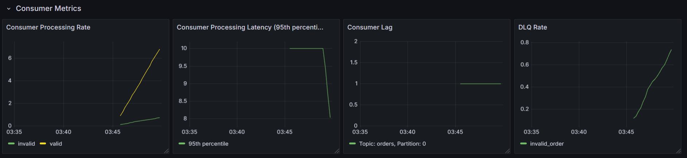
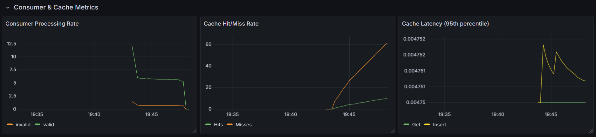
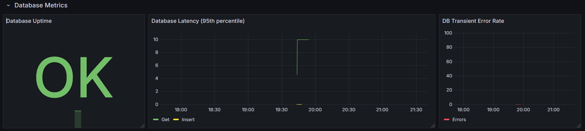

# Sentinel errors
``` Go
var (
	ErrNotFound = errors.New("no record found")
	ErrAlreadyExists = errors.New("record already exists")
	ErrConnectionFailed = errors.New("failed connection to DB")
)
```
Эти ошибки "всплывают" наверх, и вышестоящие слои на самом деле не озабочены точным типом ошибок. Таким образом, даже если хранилище данных позже изменится (например, `unique_violation` в PostgreSQL имеет код `23505`, а в MySQL для того же самого используется код `1062`), это не повлияет на них. Пример использования — когда ошибка "всплывает" до воркера, он немедленно помечает базу данных как неработоспособную с помощью HealthChecker'a

# DBHealthChecker
Это простой "пинговальщик" с настраиваемым интервалом и настраиваемым таймаутом для одного пинга. Он работает постоянно, но его atomic.Bool пременная может быть изменена воркером раньше, чем пинг-интервал. Изначально у меня была идея, чтобы он запускался только тогда, когда воркер обнаруживает, что база данных недоступна, но управлять этим оказалось слишком сложно. Поэтому `MarkUnhealthy()` — это своего рода наследие, которое находит свое применение, когда у самого healthchecker'а большой интервал (например, 15 секунд) или просто чтобы предотвратить ненужную отправку partitions из Kafka, быстрее, например, перераспределить нагрузку.
Пакет `health` можно найти [здесь](../internal/pkg/health/dbhealth.go)!

# Мониторинг
Сервис использует Prometheus, Grafana и Node-export:
- **Метрики системы-хоста:** нагрузка на CPU, RAM, Load Average (1m, 5m, 15m), Network I/O
- **Метрики API:** количество запросов а также их задержки 
- **Метрики потребителя:** частота обработки, задержка обработки, лаг потребителя и частота отправки в DLQ
- **Кэш:** частота попаданий/промахов и скорость ответа кэша на запросы Get/Insert
- **БД:** наличие соединения, время обработки запросов Get/Insert и частота транзиент-ошибок (нарушений соединения, которые не длиннее 5 мс).

## Пример метрик, отображаемых в Grafana
Собрано с помощью python-скрипта [locust](https://github.com/locustio/locust) с ~70 запросами в секунду по адресу `/orders/{id}` почти с самого запуска брокера, продюсера, бд и т.д.
### Метрики системы:


### Метрики API:


### Метрики потребителя:


### Метрики кэша:


### Метрики БД:


### Другая документация:
* [Схема базы данных](database.ru.md)
* [Принцип работы потребителя](consumer.ru.md)
* [Реализация кэша](cache.ru.md)
* [Валидация JSON](validation.ru.md)

### Вернуться к [Основному README](../../README.ru.md)
