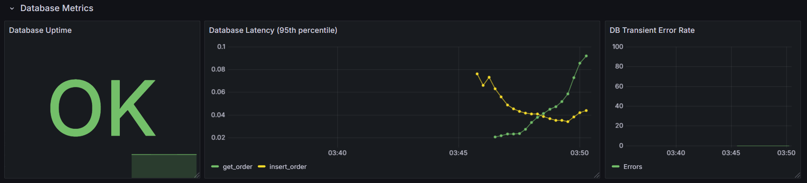
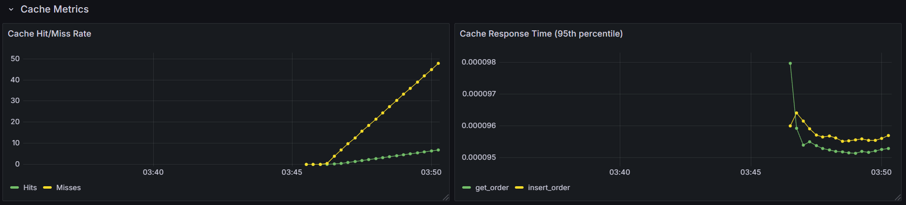

# Sentinel errors
``` Go
var (
	ErrNotFound = errors.New("no record found")
	ErrAlreadyExists = errors.New("record already exists")
	ErrConnectionFailed = errors.New("failed connection to DB")
)
```
Эти ошибки "всплывают" наверх, и вышестоящие слои на самом деле не озабочены точным типом ошибок. Таким образом, даже если хранилище данных позже изменится (например, `unique_violation` в PostgreSQL имеет код `23505`, а в MySQL для того же самого используется код `1062`), это не повлияет на них. Пример использования — когда ошибка "всплывает" до воркера, он немедленно помечает базу данных как неработоспособную с помощью HealthChecker'a

# DBHealthChecker
Это простой "пинговальщик" с настраиваемым интервалом и настраиваемым таймаутом для одного пинга. Он работает постоянно, но его atomic.Bool пременная может быть изменена воркером раньше, чем пинг-интервал. Изначально у меня была идея, чтобы он запускался только тогда, когда воркер обнаруживает, что база данных недоступна, но управлять этим оказалось слишком сложно. Поэтому `MarkUnhealthy()` — это своего рода наследие, которое находит свое применение, когда у самого healthchecker'а большой интервал (например, 15 секунд) или просто чтобы предотвратить ненужную отправку partitions из Kafka, быстрее, например, перераспределить нагрузку.
Пакет `health` можно найти [здесь](../internal/pkg/health/dbhealth.go)!

# Мониторинг
Сервис использует Prometheus и Grafana, метрики довольно простые:

*   **Общее количество HTTP-запросов** и **продолжительность HTTP-запросов**, потому что это может быть полезно для инженеров данных (возможно?(может быть..?))
*   **Количество обработанных сообщений потребителем** — это общее количество обработанных сообщений (трех типов: валидные, невалидные, ошибки).
*   **Попадания и промахи в кэше**, чтобы иметь возможность настраивать максимальное количество записей в кэше или максимальный размер одной записи в соответствии с потребностями использования. То же самое касается и **времени ответа кэша**.
*   И **Доступна ли БД?**, **Время ответа базы данных** и **Временные ошибки базы данных**, чтобы, возможно, снизить нагрузку, если база данных начнет "икать" или cjtlbytybt с ней пропадет.

## Пример метрик, отображаемых в Grafana
Собрано с помощью python-скрипта [locust](https://github.com/locustio/locust) с ~2500 одновременными пользователями (мой компьютер начал троттлить примерно на 1000, что хорошо видно по тому, как запросы 'Get' к БД стали занимать гораздо больше времени, чем ожидалось)
### База данных:



### Кэш:
