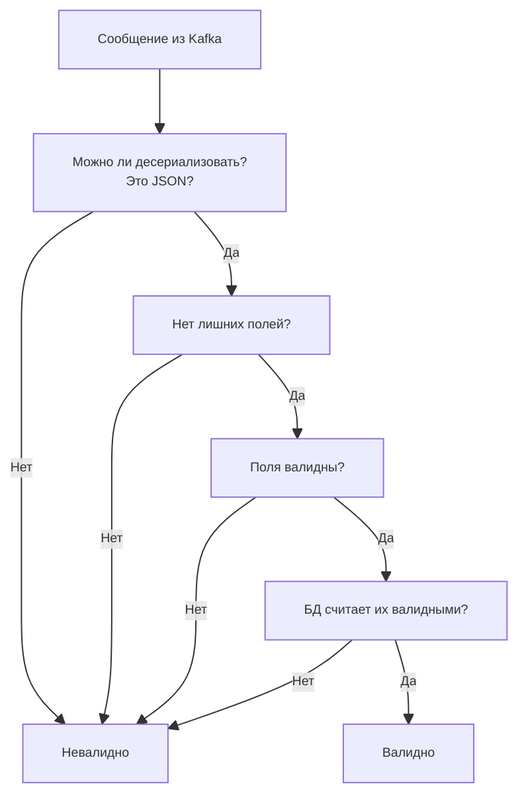

# Как происходит валидация?
На самом деле, я выделил для себя три типа данных:
1.  Полностью невалидные данные, мусор/белиберда/как бы вы это ни назвали. Искаженные JSON (то есть, на самом деле не JSON, а просто данные, которые человеку могут показаться таковыми) относятся к той же категории.
2.  Невалидные JSON, содержащие больше полей, чем ожидалось, или с невалидными данными в корректных полях.
3.  Валидные данные.



Проверки происходят в следующем порядке:
1.  Воркер выполняет десериализацию (unmarshaling) сообщения из Kafka и проверяет наличие лишних полей.
2.  Затем он передает данные на уровень сервиса (service layer/package), который использует метод `Validate()` на структуре `Order`. Сам метод `Validate()` просто проверяет теги валидации структуры, используя пакет [go-playground/validator](github.com/go-playground/v10), например:
```Go
	Items             []Item    `json:"items" validate:"required,min=1,dive"`
	Locale            string    `json:"locale" validate:"required,bcp47_language_tag"`
	InternalSignature string    `json:"internal_signature" validate:"omitempty"`
```
Использовать такие теги было гораздо проще, чем создавать собственные правила валидации, и они просто менее подвержены ошибкам, так как все они хранятся в одном месте и используют кастомные regex's. Пример для проверки телефона и валюты:
```Go
    Phone    string `json:"phone" validate:"required,e164"`
    Currency string `json:"currency" validate:"required,iso4217"`
```
3.  Последний своего рода "барьер", который должен пройти заказ, — это правила схемы базы данных.

После прохождения этих проверок заказ считается валидным, и к этому моменту транзакция в базе данных должна быть (в норме) завершена. И это все.

### Другая документация:
* [Схема базы данных](database.ru.md)
* [Принцип работы потребителя](consumer.ru.md)
* [Реализация кэша](cache.ru.md)
* [Ошибки, метрики и проверки состояния БД](misc.ru.md)

### Вернуться к [Основному README](../../README.ru.md)