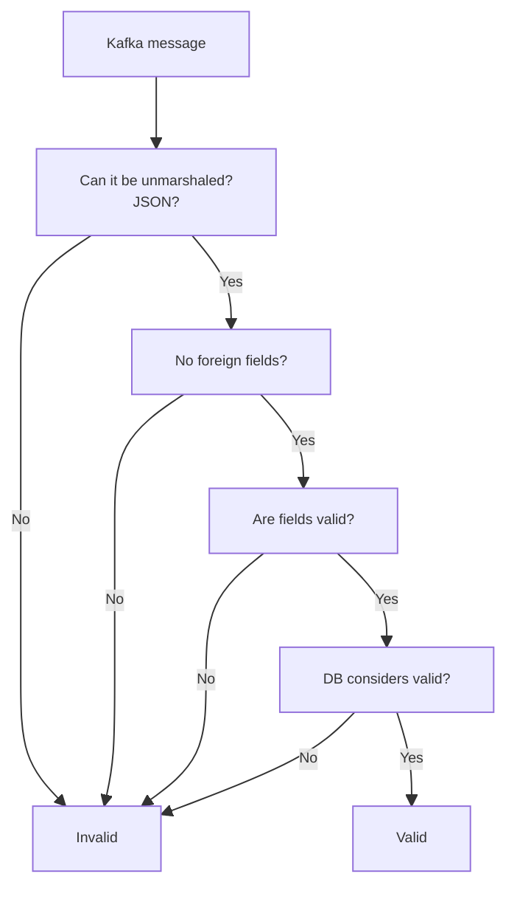

# How does validation happen?
There are actually three types of data that i've defined for myself:
1. Completely invalid data, rubbish/gibberish/whatever you want to call it. Malformed JSON's (so not really JSON's, just the data that to human might look like it is) are in the same category.
2. Ivalid JSON's having more fields than expected or with invalid data in correct fields.
3. Valid data.
 


The checks are happening in this order:
1. Unmarshaling kafka message and checking foreign fields by the worker
2. It then passes the data down to the service layer, which utilises a method on Order struct called Validate(). The validate itself simply checks the structs validation tags, using a [go-playgorund validator](github.com/go-playground/v10) package e.g.:
```Go
	Items             []Item    `json:"items" validate:"required,min=1,dive"`
	Locale            string    `json:"locale" validate:"required,bcp47_language_tag"`
	InternalSignature string    `json:"internal_signature" validate:"omitempty"`
```
Such tags were much easier to utilise than creating my own validation rules, and they are simply way less prone to errors, since all of them are stored in one place and utilise custom regex's, e.g. phone checks and currency checks:
```Go
    Phone    string `json:"phone" validate:"required,e164"`
    Currency string `json:"currency" validate:"required,iso4217"`
```
3. The last sort of 'barrier' that the order should pass is DB schema rules

After these passed, the order is deemed valid and the db transaction by that moment should be completed (normally). And that's it.

### Other Documentation:
* [Consumer Decision Tree](consumer.md)
* [Cache Implementation](cache.md)
* [Database Schema](database.md)
* [Errors, Metrics, and DB Health Checks](misc.md)

### Back to [Main README](../README.md)
